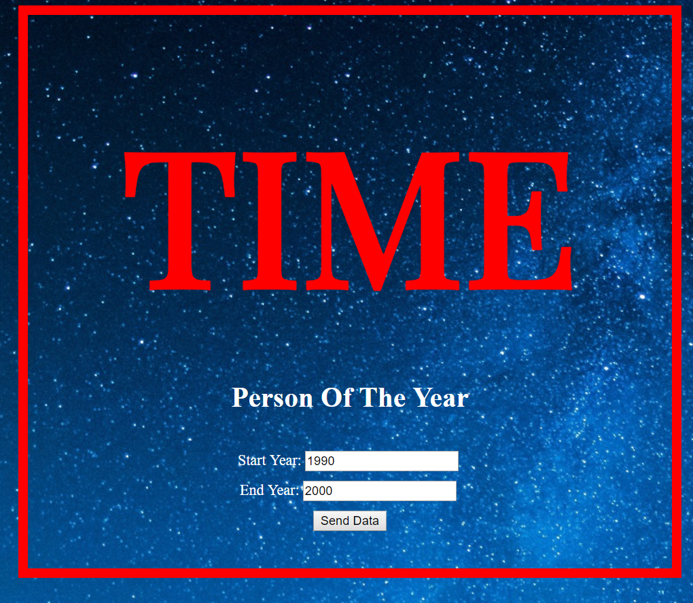
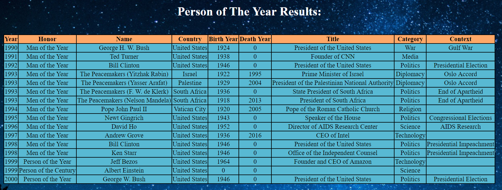

# Lab11MyFirstMVCApp

## Summary:  
This application allows the user to put in two dates and returns the people of the year who are between the two years.
To get a result, type in a 4 digit year in the input field after the start year and also after the end year.  
Once there are numbers for both fields, press the button named "Send Data" and it will redirect you to a results page.  
This results page will have a table containing all the people of the year between the inputted start year and end year.  

## Visual:  
Here is a screenshot of the start page with the form filled:  
  

Here is a screenshot of the results page using the dates from the above:  
  

## How to Use:
1. Download Visual Studio  
2. Clone this repository, "Lab11MyFirstMVCApp"
3. In the repository, open "Lab11PersonsOfTheYear.sln" in Visual Studio
4. In the Debug menu, press the "Start Without Debugging" option
5. Enter a start year and end year and then press the "Send Data" button

## Resources used:
[Background Photo](https://www.pexels.com/photo/astronomy-background-constellation-cosmic-355887/)  
Rhiannon Mortensen helped determine the colors in the table.  
Eric Singleton helped with making sure I was on the right track.  

